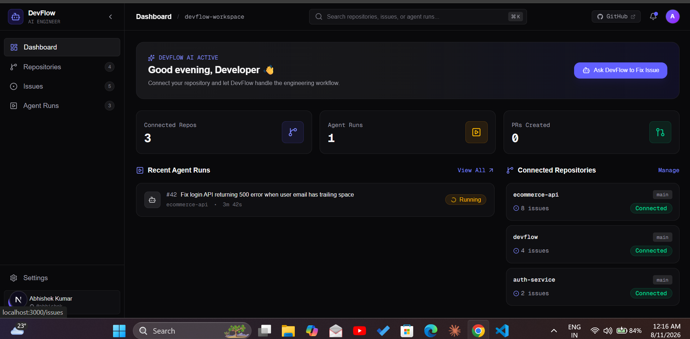
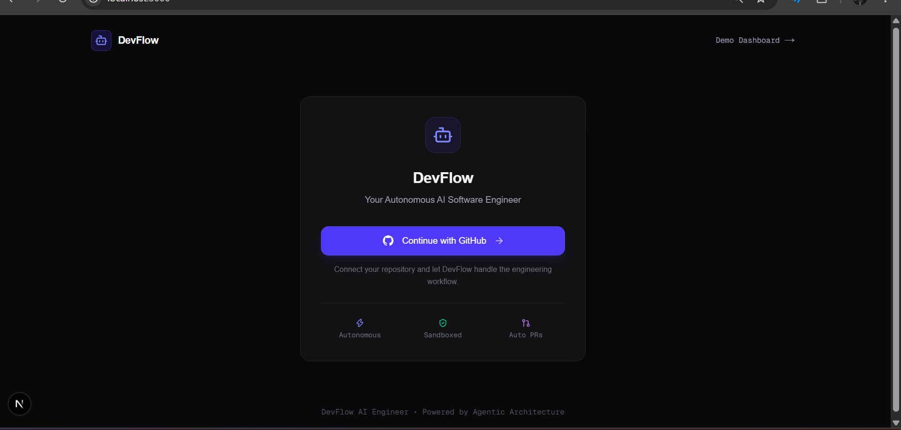

# DevFlow — AI Software Engineer

> An AI-powered software engineering platform designed to assist developers with building, understanding, debugging, and managing software projects.
>
> ## Preview



## 🚀 Overview

**DevFlow** is an AI-powered software engineering assistant that brings intelligent development workflows into a single platform.

It is designed to help developers work with their codebase more efficiently by combining AI agents, project context, intelligent task execution, and developer-focused tooling.

The goal of DevFlow is to make software development faster, smarter, and more accessible by allowing developers to interact with their projects using natural language.

## ✨ Features

* 🤖 **AI-Powered Software Engineering Assistant**
* 🧠 **Intelligent Code Understanding**
* 💬 **Natural Language Interaction**
* 📁 **Project & Codebase Context**
* ⚡ **AI-assisted Development Workflows**
* 🔍 **Code Analysis & Debugging**
* 🛠️ **Developer-focused Dashboard**
* 🔌 **MCP-based Tool Integration**
* 🧩 **Agent-based Architecture**
* 📊 **Centralized Development Workspace**

## 🖥️ Screenshots

### Landing Page



### Dashboard


## 🏗️ Architecture

DevFlow follows a modern AI-powered application architecture combining a web interface with intelligent agents and developer tools.

```text
User
  │
  ▼
DevFlow Web Interface
  │
  ▼
AI Agent Layer
  │
  ├── Code Understanding
  ├── Task Planning
  ├── Tool Execution
  └── Project Context
  │
  ▼
Developer Tools / MCP
  │
  ▼
Project Codebase
```

## 🛠️ Tech Stack

### Frontend

* Next.js
* React
* TypeScript
* Tailwind CSS
* shadcn/ui

### AI & Agent Layer

* OpenAI Agents SDK
* Claude
* LangGraph
* MCP (Model Context Protocol)

### Backend & Data

* Node.js
* PostgreSQL
* Prisma
* Redis
* BullMQ

### Development & Deployment

* Docker
* GitHub Actions
* Git

## 📂 Project Structure

```text
DevFlow/
├── public/
├── src/
├── AGENTS.md
├── CLAUDE.md
├── eslint.config.mjs
├── next.config.ts
├── package.json
├── package-lock.json
├── postcss.config.mjs
├── README.md
└── tsconfig.json
```

## ⚙️ Getting Started

### 1. Clone the repository

```bash
git clone https://github.com/Jerry-Abhi/DevFlow-AI-Software-Engineer.git
cd DevFlow-AI-Software-Engineer
```

### 2. Install dependencies

```bash
npm install
```

### 3. Configure environment variables

Create a `.env.local` file in the root directory and add the required environment variables.

```env
# Add your required API keys and configuration here
```

> Never commit `.env.local` or any API keys/secrets to GitHub.

### 4. Start the development server

```bash
npm run dev
```

Open your browser and visit:

```text
http://localhost:3000
```

## 🎯 Project Goals

DevFlow aims to explore how modern AI agent architectures can improve traditional software development workflows.

The project focuses on:

* AI-assisted programming
* Agentic software development
* Context-aware code interaction
* Developer productivity
* Tool orchestration
* Modern full-stack architecture

## 🔮 Future Improvements

* Advanced autonomous coding agents
* Improved repository-level code understanding
* Automated testing and debugging
* GitHub repository integration
* Multi-agent collaboration
* Real-time code execution
* Enhanced project analytics
* Cloud-based deployment workflows

## 👨‍💻 Author

**Abhishek Anand**

Computer Science & Engineering

---

⭐ If you find DevFlow interesting, consider giving the repository a star!
